

<a href="https://sanketdevstories.in/about">
  <picture>
    <source media="(prefers-color-scheme: dark)" srcset="assets/banner-dark.svg">
    
  </picture>
</a>

  

<picture>
  <source media="(prefers-color-scheme: dark)" srcset="assets/stats-dark.svg">
  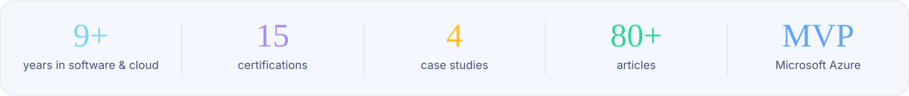
</picture>

### Hi, I'm Sanket 👋

I design **Azure platforms**, automate infrastructure with **Terraform, GitHub Actions and Azure DevOps**, and bring **AI agents into production**. I'm based in Helsinki and build agent platforms for healthcare customers at Tieto. Fun fact: I work with the best cloud team in the world. 😆

<a href="https://sanketdevstories.in/about"></a>

<picture>
  <source media="(prefers-color-scheme: dark)" srcset="assets/quote-dark.svg">
  
</picture>

## 🚀 The pipeline so far

<a href="https://sanketdevstories.in/#story">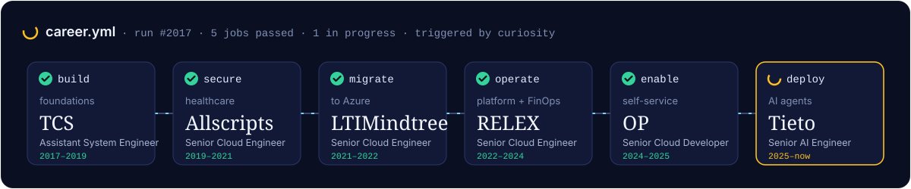</a>

## 🧠 How I work

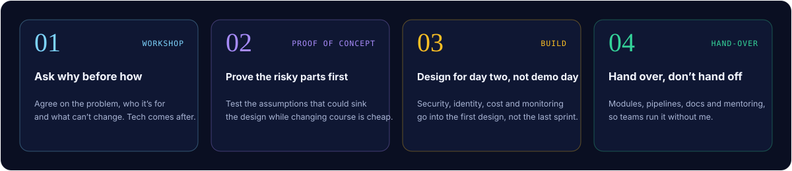

## 🧭 Case studies

<a href="https://sanketdevstories.in/work/finops">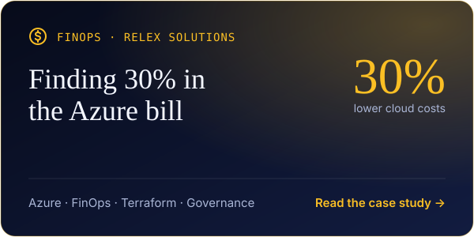</a>
<a href="https://sanketdevstories.in/work/self-service-azure">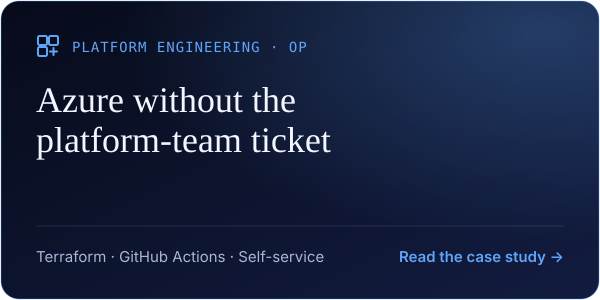</a>
<a href="https://sanketdevstories.in/work/security-agents">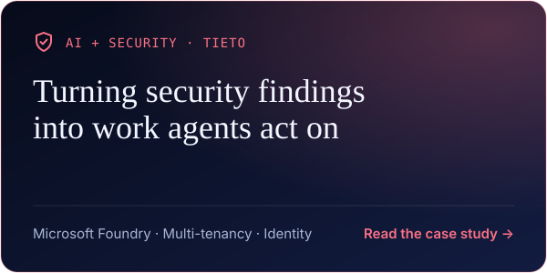</a>
<a href="https://sanketdevstories.in/work/ai-gateway">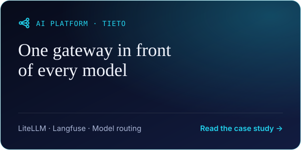</a>

Also: <b>90% less manual access work</b> with Entra ID automation (RELEX) · <b>40% faster legacy apps</b> (TCS) · Azure migrations (LTIMindtree) · GitHub Copilot + MCP with customer context (Tieto) · <a href="https://sanketdevstories.in/work">all work →</a>

## 🎤 On stage

<table>
<tr>
<td width="33%" valign="top">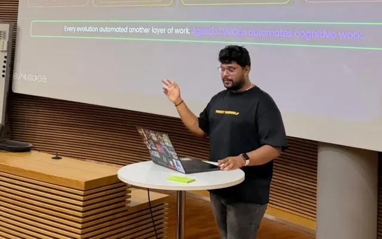 <b>Microsoft Agentic AI & DevOps Days</b> Agentic DevOps: Copilot agents, Foundry agents and GitHub Actions from planning to incidents</td>
<td width="33%" valign="top">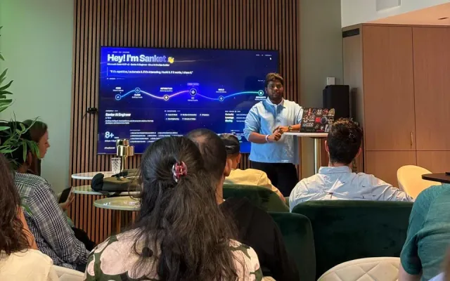 <b>DataTribe Collective, Helsinki</b> Production AI with Microsoft Foundry: prompts, evaluation and running AI in production</td>
<td width="33%" valign="top">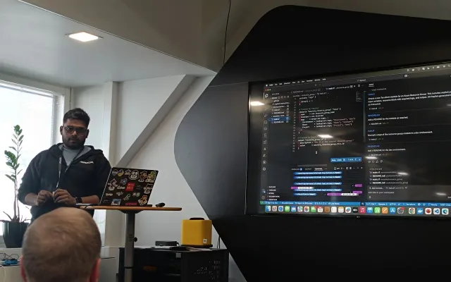 <b>Microsoft DevXperience</b> BYOK for GitHub Copilot: your own keys and custom models for enterprise teams</td>
</tr>
</table>

**Community:** 🏆 **Two-time Microsoft MVP (Azure)** for Terraform AzureRM → AzAPI migration guidance, architecture workshops, open-source templates and mentoring · 🎯 **Top 1% Club of Experts** on [Topmate](https://topmate.io/sanketjoshi3103), with People's Choice and Community Leader recognition · 🧑‍🏫 **Microsoft Certified Trainer**

## ✍️ Latest writing

<table>
<!-- BLOG-POST-LIST:START --><tr><td width="240"></td><td><a href="https://sanketdevstories.in/blog/how-to-choose-an-azure-cloud-architect-or-devops-engineer-in-finland"><b>How to Choose an Azure Cloud Architect or DevOps Engineer in Finland</b></a> Sep 27, 2026</td></tr>
<tr><td width="240"></td><td><a href="https://sanketdevstories.in/blog/enterprise-ai-governance-using-azure-purview-and-compliance-manager"><b>Enterprise AI Governance: Using Azure Purview and Compliance Manager</b></a> Dec 23, 2025</td></tr>
<tr><td width="240"></td><td><a href="https://sanketdevstories.in/blog/azure-copilot-ai-powered-cloud-operations-and-migration"><b>Azure Copilot: AI-Powered Cloud Operations and Migration</b></a> Dec 17, 2025</td></tr>
<tr><td width="240"></td><td><a href="https://sanketdevstories.in/blog/multi-agent-orchestration-advances-in-azure-ai-foundry-2025"><b>Multi-Agent Orchestration Advances in Azure AI Foundry &lpar;2025&rpar;</b></a> Dec 10, 2025</td></tr>
<!-- BLOG-POST-LIST:END -->
</table>

<a href="https://sanketdevstories.in/resource">All articles →</a> · <a href="https://sanketdevstories.in/rss.xml">RSS</a>

## 🧰 Toolkit

Also: Azure DevOps · Microsoft Foundry · Agent Framework · GitHub Copilot · MCP · Entra ID & PIM · Microsoft Graph · Landing Zones · FinOps · Databricks

## 🎖️ Certifications

<a href="https://www.credly.com/users/sanketjoshi31">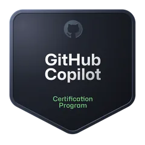</a>

<a href="https://www.credly.com/users/sanketjoshi31">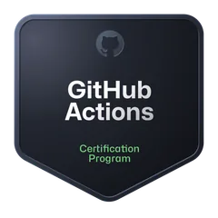</a>

<a href="https://www.credly.com/badges/6b734acc-ca67-4153-a96b-5facfcacabd9">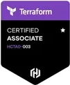</a>
<a href="https://www.credly.com/users/sanketjoshi31">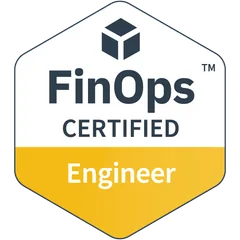</a>
<a href="https://www.credly.com/badges/ea68a3e5-bd7d-4262-8c9f-b16615d70375">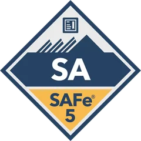</a>
<a href="https://www.credly.com/users/sanketjoshi31">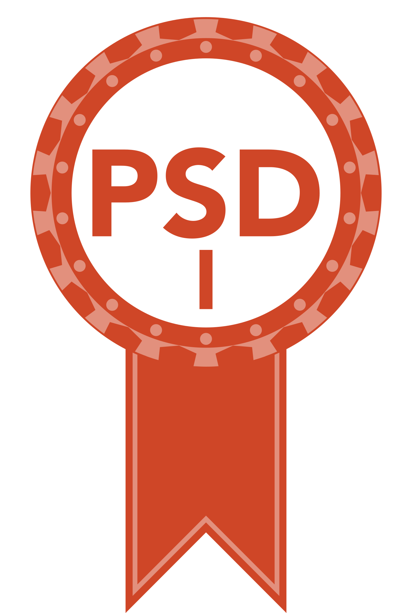</a>

## 🛠️ Open source

**[Azure Multi-Client Manager (AZM)](https://github.com/realsanket/azm-client-manager)**: a cross-platform CLI (Bash & PowerShell) that keeps each client's Azure session isolated, detects expired logins and compares environments. No more commands run in the wrong tenant.

## 🤝 Let's talk

> 🌟 *Empowering the next generation of cloud and AI engineers through community, mentorship and innovation.*

**Mentoring** on [Topmate](https://topmate.io/sanketjoshi3103) · **Speaking** on Azure, platform engineering and agentic DevOps · **Roles & collaborations** via [LinkedIn](https://www.linkedin.com/in/sanketjoshi31/) or [email](mailto:joshisanket097@gmail.com)

## 🎮 Deploy to my production

My profile runs a tiny production system, and **you're on call**. Pick an action: it opens an issue, a real GitHub Actions pipeline runs your change, replies to you, and puts you in the release log below. Deploying on a Friday is allowed. It's just a very bad idea.

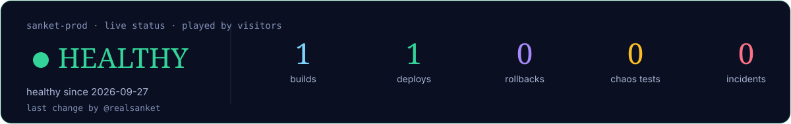

<b>📜 Release log</b>

 

<!-- PROD-LOG:START -->
| Build | Who | Action | Result | Date |
|---|---|---|---|---|
| #1 | [@realsanket](https://github.com/realsanket) | 🚀 ship | ✅ Build #1 deployed. All health checks green. | 2026-09-27 |
<!-- PROD-LOG:END -->

## 🐍 Contributions

<picture>
  <source media="(prefers-color-scheme: dark)" srcset="https://raw.githubusercontent.com/realsanket/realsanket/output/github-snake-dark.svg">
  
</picture>

